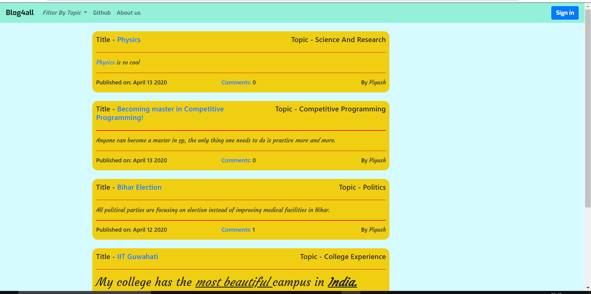
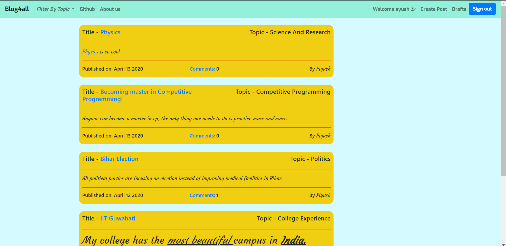
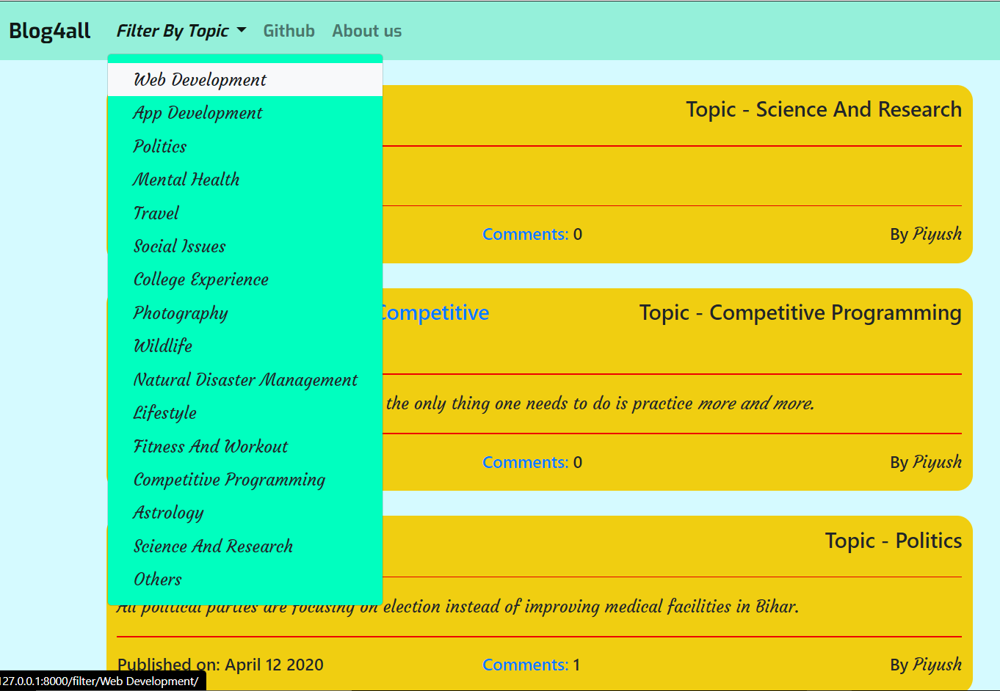
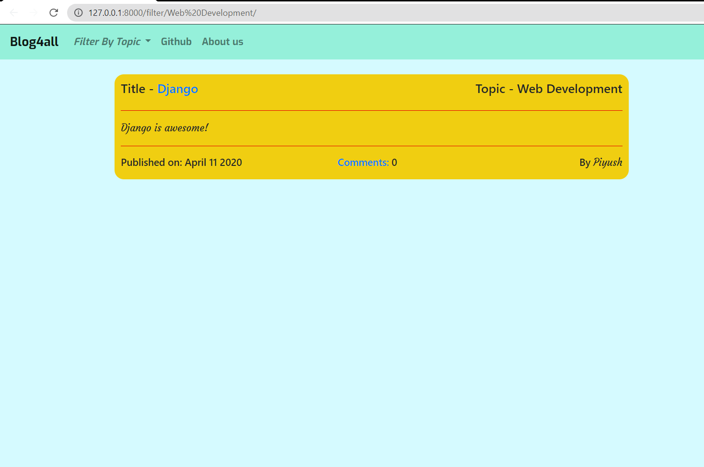
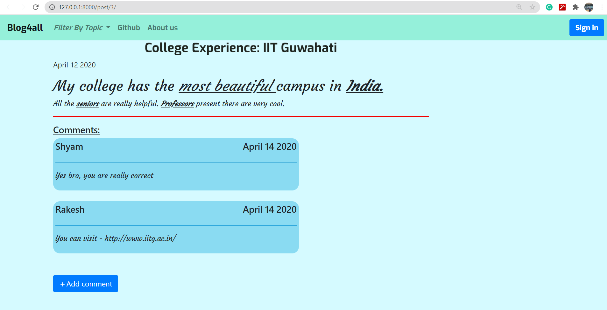

<h1 align = 'center'>  Blog4all </h1>

<h2> Introduction</h2>

 This is a blogging website where users can write blogs. Each blogs have a comment section where viewers can write their views about the blog.

<h2> Special features: </h2>
<ul>
  <li> Blogs can be easily filtered according to the user's requirement. </li> 
  <li> There is an approval system where each comments need to be approved by the blog author before it is to be published. </li>
  <li> There is a draft section for the registered users which will contain only blog posts that is not published so far and will save the progress of their work. </li>
  <li> While creating a blog post, users can also add text styling features such as link embedding, making text bold/italic, large/medium heading etc.
</ul>
<h2> Sample images: </h2>
<ul> 
  <li> <h3> Home page </h3>
    <ol> 
      <li> <h4> For guest user </h4>    </li>
      <li> <h4> For Registered user </h4>    </li>
    </ol>
  <li>  <h3> Filter View </h3>
      <ul>
        <li> <h4> Available filters </h4>    </li>
        <li> <h4> After applying filter of 'Web Development' </h4>     </li> 
       </ul>
  <li> <h3> Detail View of a blog </h3> 
         
    
  
